# PX-Swarm System Schematics

Reference overview: see the [README](../README.md) for the project summary. These two documents are intended to be easy to view side by side.

## EN: How the whole environment works

### 1. Layered view

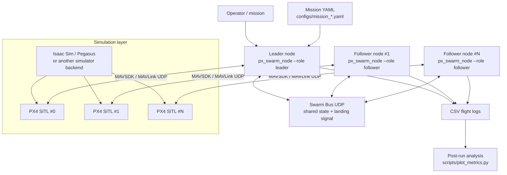

### 2. What each layer does

- `px_swarm_node` is a single process that controls exactly one drone.
- The leader flies manually from the keyboard or executes a waypoint mission loaded from YAML.
- A follower does not receive direct operator commands; it receives swarm state and computes its own target.
- PX4 SITL provides autopilot behavior and flight dynamics.
- The world simulator provides the environment and vehicle models; the PX-Swarm control logic talks directly to PX4, so the controller is decoupled from the exact simulator backend.
- The Swarm Bus is a separate UDP channel used only for inter-agent coordination, not PX4 control.

### 3. Runtime topology

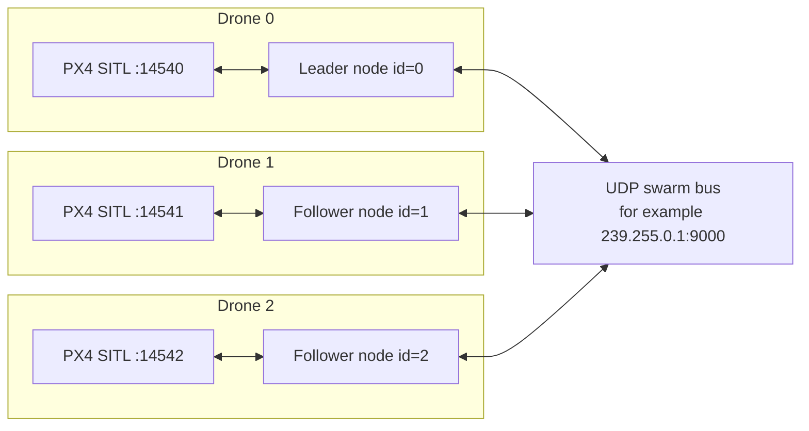

### 4. Startup sequence

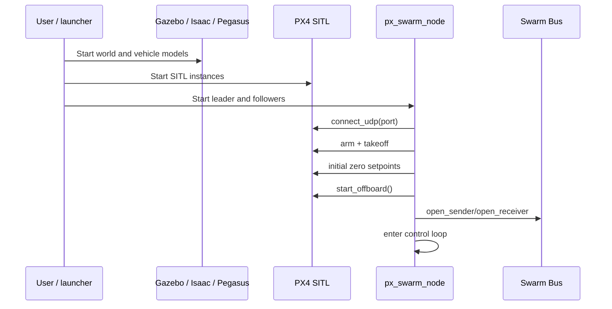

### 5. Main loop inside one `px_swarm_node`

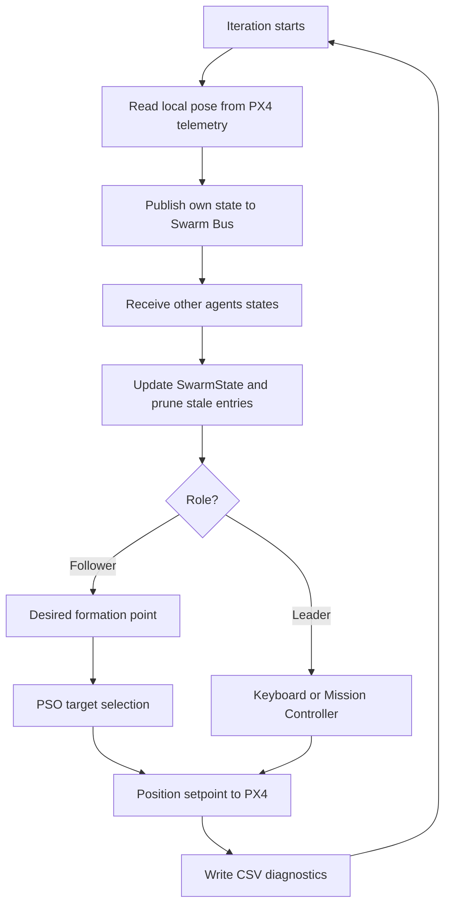

### 6. Leader control flow

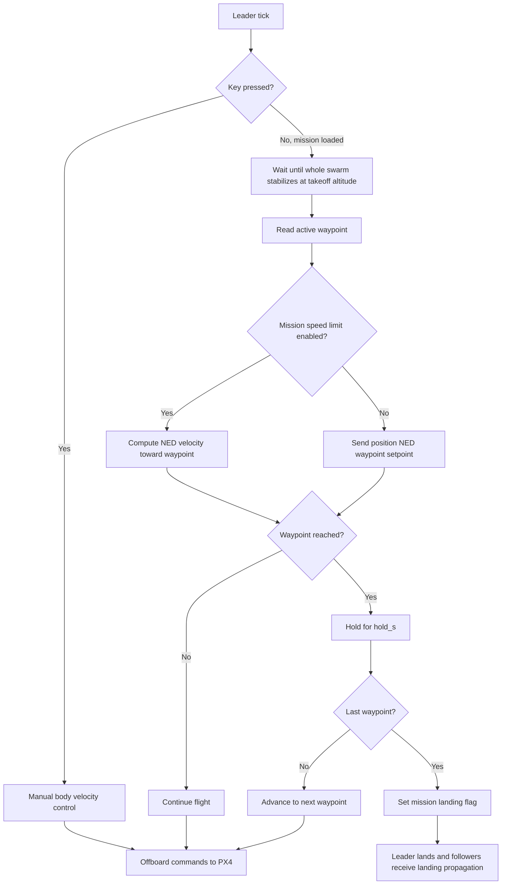

### 7. Follower control flow

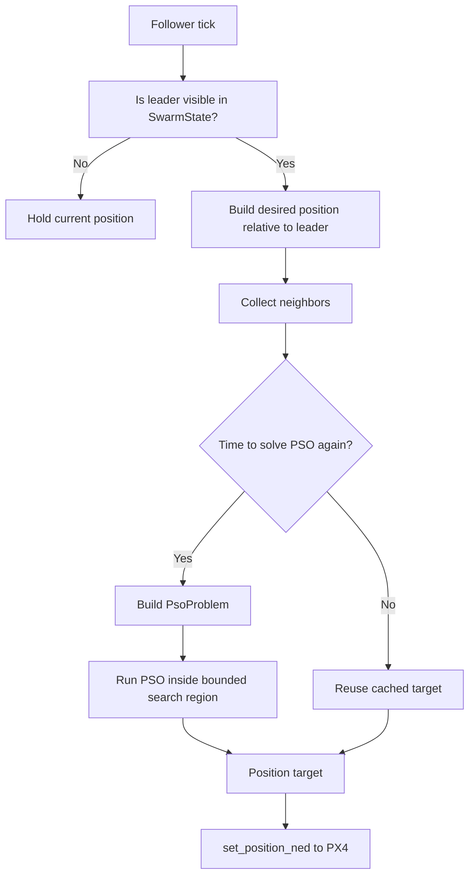

### 8. Inputs, outputs, and diagnostics

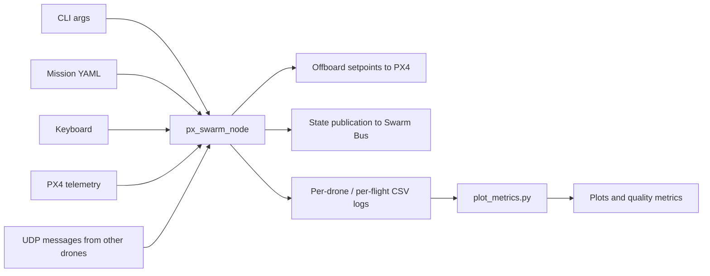

### 9. Module map

| Module | Responsibility |
|---|---|
| `src/app/px_swarm_node_main.cpp` | process startup, main loop, mission handling, logging, shutdown |
| `src/app/cli.cpp` | CLI argument parsing |
| `src/app/mission.cpp` | waypoint mission loading from YAML |
| `src/control/px4_interface.cpp` | MAVSDK/PX4 connection, telemetry, Offboard commands |
| `src/control/leader_controller.cpp` | manual leader control |
| `src/control/follower_controller.cpp` | follower logic: desired point + PSO + target tracking |
| `src/swarm/swarm_bus.cpp` | UDP messaging between agents |
| `src/swarm/swarm_state.cpp` | local swarm snapshot and stale-data pruning |
| `src/swarm/pso.cpp` | follower target optimization |
| `scripts/launch_gazebo_px4_instance.sh` | starts Gazebo world and models |
| `scripts/launch_px_swarm_instance.sh` | starts multiple PX4 and `px_swarm_node` instances |
| `scripts/plot_metrics.py` | post-flight log analysis |

### 10. Short end-to-end summary

1. The simulator starts the world and the drone models.
2. PX4 SITL starts a separate autopilot instance for each drone.
3. Each `px_swarm_node` connects to exactly one PX4 instance via MAVSDK.
4. The leader receives keyboard control or waypoint mission data.
5. All nodes publish their current state over UDP to the shared swarm bus.
6. Followers reconstruct a local swarm view and compute an optimal target using PSO.
7. Offboard setpoints are sent back to PX4, while each flight is logged to CSV.
8. At mission completion, the leader broadcasts a landing flag so the whole swarm lands coherently.

## PL: Schemat działania całego środowiska

### 1. Widok warstwowy

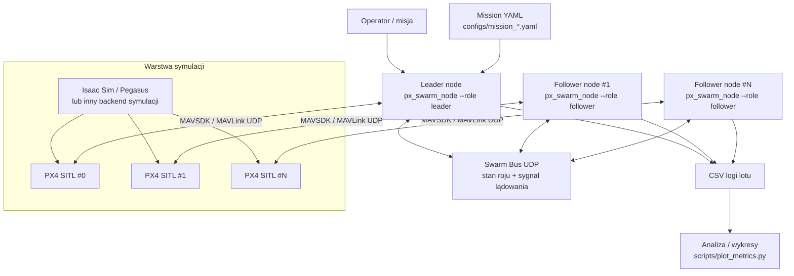

### 2. Co jest czym

- `px_swarm_node` to pojedynczy proces sterujący dokładnie jednym dronem.
- Lider steruje lotem ręcznie z klawiatury albo wykonuje misję waypointową z pliku YAML.
- Follower nie dostaje bezpośrednich komend od operatora; odbiera stan roju i sam liczy cel lotu.
- PX4 SITL odpowiada za autopilota i dynamikę lotu.
- Symulator świata dostarcza środowisko i modele; logika PX-Swarm komunikuje się jednak bezpośrednio z PX4, więc sam kontroler jest oddzielony od konkretnego backendu symulacji.
- Swarm Bus to osobny kanał UDP używany tylko do koordynacji agentów, nie do sterowania PX4.

### 3. Topologia runtime

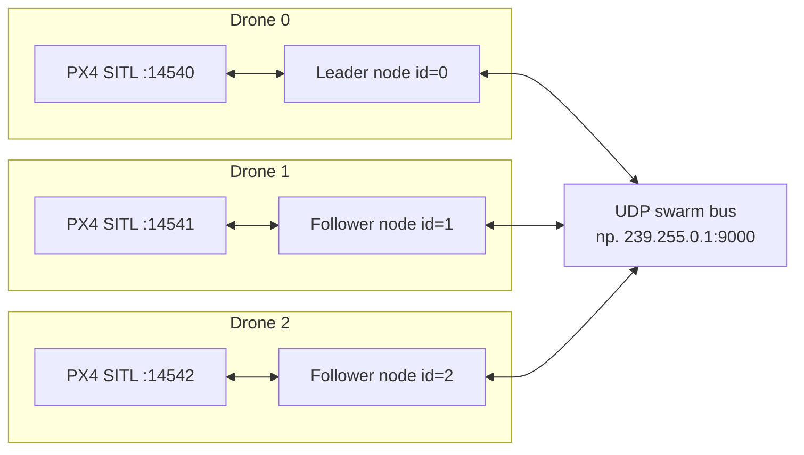

### 4. Sekwencja uruchomienia

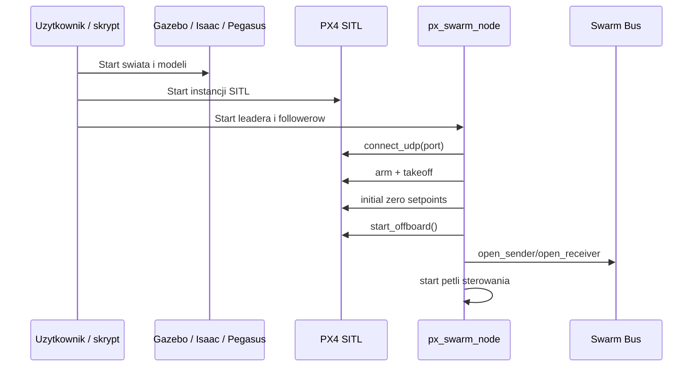

### 5. Pętla główna jednego `px_swarm_node`

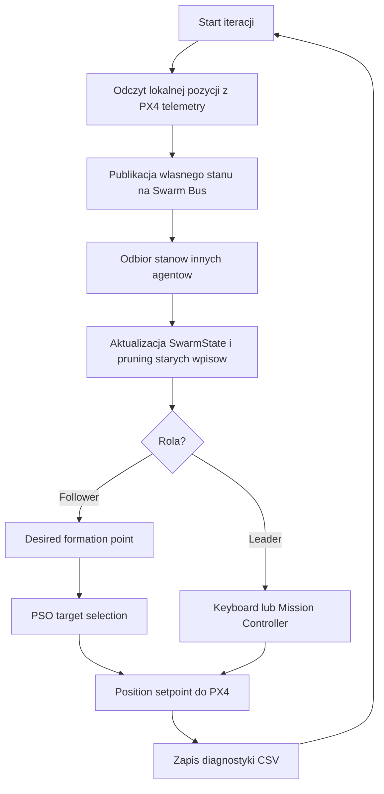

### 6. Przepływ sterowania lidera

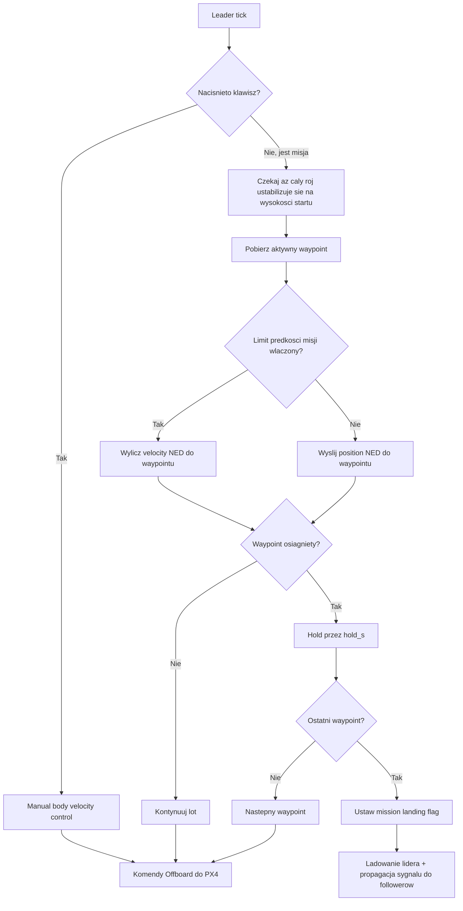

### 7. Przepływ sterowania followera

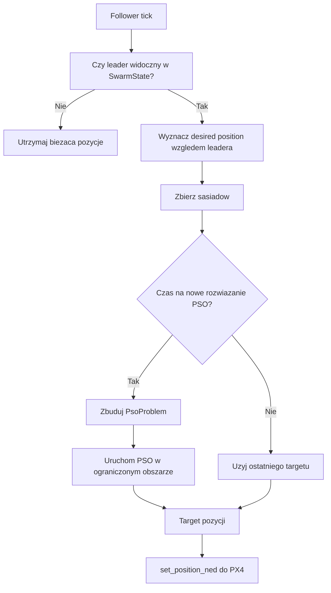

### 8. Dane wejściowe, wyjściowe i diagnostyka

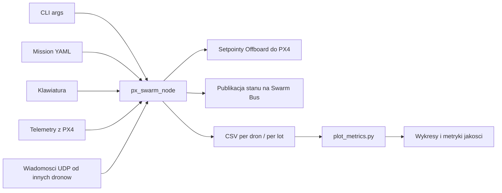

### 9. Mapa modułów w repo

| Moduł | Odpowiedzialność |
|---|---|
| `src/app/px_swarm_node_main.cpp` | start procesu, główna pętla, misja, logowanie, shutdown |
| `src/app/cli.cpp` | parsowanie parametrów CLI |
| `src/app/mission.cpp` | ładowanie misji waypointowej z YAML |
| `src/control/px4_interface.cpp` | połączenie MAVSDK z PX4, telemetry, Offboard |
| `src/control/leader_controller.cpp` | sterowanie ręczne lidera |
| `src/control/follower_controller.cpp` | logika followera: desired point + PSO + target tracking |
| `src/swarm/swarm_bus.cpp` | wymiana komunikatów UDP między agentami |
| `src/swarm/swarm_state.cpp` | lokalny obraz roju i wygaszanie starych danych |
| `src/swarm/pso.cpp` | optymalizacja pozycji followera |
| `scripts/launch_gazebo_px4_instance.sh` | start świata i modeli Gazebo |
| `scripts/launch_px_swarm_instance.sh` | start wielu instancji PX4 i `px_swarm_node` |
| `scripts/plot_metrics.py` | analiza logów po locie |

### 10. Najkrótszy opis end-to-end

1. Symulator uruchamia świat i modele dronów.
2. PX4 SITL uruchamia osobny autopilot dla każdego drona.
3. Każdy `px_swarm_node` łączy się z jednym PX4 przez MAVSDK.
4. Leader dostaje sterowanie z klawiatury albo waypointy z misji.
5. Wszystkie nody publikują swój stan przez UDP do wspólnego busa.
6. Followery odbudowują lokalny obraz roju i wyznaczają optymalny target przez PSO.
7. Setpointy Offboard wracają do PX4, a lot jest logowany do CSV.
8. Po końcu misji leader rozsyła flagę lądowania, a cały roj kończy lot spójnie.

## Notes

- The control layer depends on PX4/MAVSDK and the swarm UDP bus, so it can work with different simulator backends as long as PX4 exposes MAVLink UDP.
- These schematics were derived directly from the current implementation in `src/app`, `src/control`, `src/swarm`, `configs`, and `scripts`.
